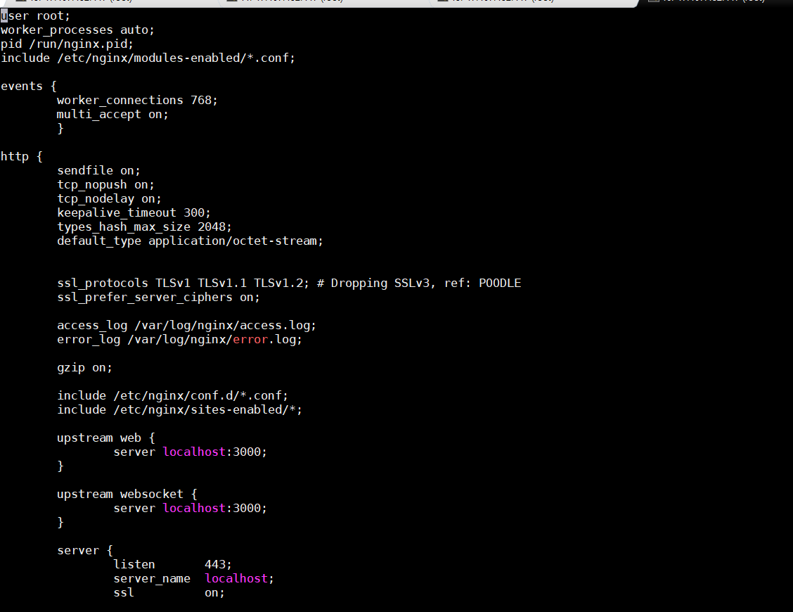

> Webrtc服务器搭建后台项目地址
>
> java项目:https://github.com/androidtencent/WebRtcJavaWeb
>
> NodeJs项目 : https://github.com/ddssingsong/webrtc_server

**本搭建是基于centos  7.6 64位系统，系统恢复原始状态，重新装系统，确保人人都能搭建成功**

如果系统安装了基础软件  如git  gcc++  可以跳该步骤

```
yum update
yum install git
yum install  make
yum install gcc-c++
```


#### 1.1  搭建Node环境

下载官网最新nodejs：https://nodejs.org/en/download

```
mkdir webrtc
cd webrtc
wget https://nodejs.org/dist/v10.16.0/node-v10.16.0-linux-x64.tar.xz
```

```
# 解压
tar -xvf node-v10.16.0-linux-x64.tar.xz
# 改名
mv node-v10.16.0-linux-x64 nodejs
# 进入目录
cd nodejs/

# 确认一下nodejs下bin目录是否有node 和npm文件，如果有就可以执行软连接
sudo ln -s /root/webrtc/nodejs/bin/npm /usr/local/bin/
sudo ln -s /root/webrtc/nodejs/bin/node /usr/local/bin/

# 看清楚，这个路径是你自己创建的路径，我的路径是/home/dds/webrtc/nodejs

#查看是否安装
node -v 
npm -v 

# 注意，ubuntu 有的是需要sudo,如果不想sudo,可以
sudo ln -s /root/webrtc/nodejs/bin/node /usr/bin/
```

#### 1.2 安装turn服务器的环境准备

```
cd ..
yum install openssl openssl-libs libevent2 libevent-devel
yum install openssl-devel
yum install sqlite
yum install sqlite-devel
yum install postgresql-devel
yum install postgresql-server
yum install mysql-devel
yum install mysql-server
yum install hiredis
yum install hiredis-devel
```

#### 1.3开始安装turn服务器

```
git clone https://github.com/coturn/coturn 
cd coturn 
./configure 
make 
sudo make install

```

查看是否安装成功

```
which turnserver

```

生成用户名和密码

```
turnadmin -k -u ddssingsong -r north.gov -p 123456
```

```
0xfb76c57e823de97df580e573437ef54a
0: log file opened: /var/log/turn_1791_2019-07-31.log
0: SQLite connection was closed.

```

安全访问秘钥  **0xfb76c57e823de97df580e573437ef54a**

接下来配置turnserver  的配置文件，配置文件存放在/usr/local/etc/turnserver.config文件下

这个文件本身是不存在的，需要我们自己创建

创建内容

```
verbose
fingerprint
lt-cred-mech
realm=test
user=ddssingsong:0xfb76c57e823de97df580e573437ef54a
user=ddssingsong:123456
stale-nonce
no-loopback-peers
no-multicast-peers
mobility
no-cli
```

该配置文件是不存在的、

user="是你本机生成的随机ID  不要全部直接复制了"


#### 1.4安装Webrtc服务端

```
安装webrtc服务器和浏览器端

git clone https://github.com/androidtencent/WebrtcNodeJS
cd WebrtcNodeJS
npm install
```

#### 1.5  安装nginx服务器（推荐用编译俩安装）

```
wget -C http://nginx.org/download/nginx-1.12.0.tar.gz
tar xvf nginx-1.12.0.tar.gz
cd nginx-1.12.0

./configure --prefix=/usr/local/nginx --with-http_stub_status_module --with-http_ssl_module

make 

sudo make install 

```


#### 1.6 更改nginx 配置文件   （额外强调  其中包含https证书，下面会告诉生成方式）

删除配置文件内容,更改为以下内容



```
user root;
worker_processes auto;
pid /run/nginx.pid;
include /etc/nginx/modules-enabled/*.conf;

events {
	worker_connections 768;
        multi_accept on;
	}

http {
	sendfile on;
	tcp_nopush on;
	tcp_nodelay on;
	keepalive_timeout 300;
	types_hash_max_size 2048;
	default_type application/octet-stream;


	ssl_protocols TLSv1 TLSv1.1 TLSv1.2; # Dropping SSLv3, ref: POODLE
	ssl_prefer_server_ciphers on;

	access_log /var/log/nginx/access.log;
	error_log /var/log/nginx/error.log;

	gzip on;

	include /etc/nginx/conf.d/*.conf;
	include /etc/nginx/sites-enabled/*;

        upstream web {
		server localhost:3000;      
        }
	
	upstream websocket {
		server localhost:3000;   
        }

	server { 
		listen       443; 
		server_name  localhost;
		ssl          on;

		ssl_certificate     /cert/cert.crt;#配置证书
		ssl_certificate_key  /cert/cert.pem;#配置密钥
			ssl_session_cache    shared:SSL:1m;
		ssl_session_timeout  50m;
		ssl_protocols TLSv1 TLSv1.1 TLSv1.2 SSLv2 SSLv3;
		ssl_ciphers  HIGH:!aNULL:!MD5;
		ssl_prefer_server_ciphers  on;
		
		location /wss {
		proxy_pass http://websocket/; # 代理到上面的地址去
		proxy_read_timeout 300s;
		proxy_set_header Host $host;
		proxy_set_header X-Real_IP $remote_addr;
		proxy_set_header X-Forwarded-for $remote_addr;
		proxy_set_header Upgrade $http_upgrade;
		proxy_set_header Connection 'Upgrade';	
 		 }
		location / {
		proxy_pass         http://web/;
		proxy_set_header   Host             $host;
		proxy_set_header   X-Real-IP        $remote_addr;
		proxy_set_header   X-Forwarded-For  $proxy_add_x_forwarded_for;
 		 }
	}
}

```

#### 1.7 生成nginx中的https证书


  1.key的生成 

> openssl genrsa -des3 -out server.key 2048 

这样是生成rsa私钥，des3算法，openssl格式，2048位强度。server.key是密钥文件名。为了生成这样的密钥，需要一个至少四位的密码。可以通过以下方法生成没有密码的key:

> openssl rsa -in server.key -out server.key 


server.key就是没有密码的版本了。 


  2.生成CA的crt

> openssl req -new -x509 -key server.key -out ca.crt -days 3650 

生成的ca.crt文件是用来签署下面的server.csr文件。 


3. csr的生成方法

> openssl req -new -key server.key -out server.csr 

需要依次输入国家，地区，组织，email。最重要的是有一个common name，可以写你的名字或者域名。如果为了https申请，这个必须和域名吻合，否则会引发浏览器警报。生成的csr文件交给CA签名后形成服务端自己的证书。 


4. crt生成方法

CSR文件必须有CA的签名才可形成证书，可将此文件发送到verisign等地方由它验证，要交一大笔钱，何不自己做CA呢。

> openssl x509 -req -days 3650 -in server.csr -CA ca.crt -CAkey server.key -CAcreateserial -out server.crt

输入key的密钥后，完成证书生成。-CA选项指明用于被签名的csr证书，-CAkey选项指明用于签名的密钥，-CAserial指明序列号文件，而-CAcreateserial指明文件不存在时自动生成。

最后生成了私用密钥：server.key和自己认证的SSL证书：server.crt

证书合并：

> cat server.key server.crt > server.pem

#### 1.8分别启动服务

启动turnserver服务

> /usr/local/bin/turnserver --syslog -a -f --min-port=32355 --max-port=65535 --user=dds:123456 -r dds --cert=turn_server_cert.pem --pkey=turn_server_pkey.pem --log-file=stdout -v


启动nginx服务

> ./usr/local/nginx/sbin/nginx

启动webrtc 服务

> cd /root/webrtc/WebrtcNodeJS
>
> 
>
> node server